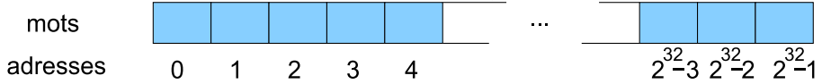
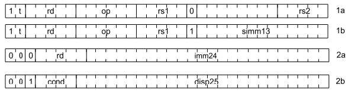
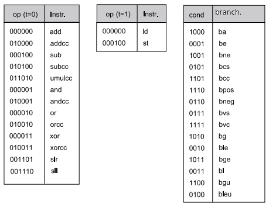
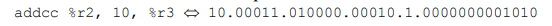

# CRAPS Microprocessor

A minimalistic FPGA CRAPS microprocessor implemented in SHDL* and designed in a RISC architecture which is a reduced computing instruction set.  
This was an educational project directed by [Jean-Christophe Buisson](https://amazon.fr/stores/Jean-Christophe-Buisson/author/B004N2KQXM) at ENSEEIHT and I really enjoyed working on it to discover progamming logical logic circuits and how microprocessors work.

## How it works

The CRAPS microprocessor is deisgned around a deliberately minimalistic architecture.
The instruction set is designed to represent the simplest form of computing operations for basic tasks.  

This microprocessor features: 
- Arithmetic Logic Unit (ALU) : handles basic arithmetic operations listed below
- Sequencer & Program Counter (PC) : sequentially executes instructions in memory

## Specifications

### 32bits RISC-ISA - Instruction Set
* Reduced Instruction Set Computer and Instruction Set Architecture

RISC artichecture is born in the 80s and are limited but exploits a simple and powerful ISA unlike CISC with x86 ISA for example.

CRAPS is a 32 bits processor which basically means that due to its 32 bits registers can add and substract 32 bits numbers and multiply 16 bits by 16 bits. 

But CRAPS is can't manipulate floating numbers and can't do any floating operations.

Except binary 32 bits signed or unsigned numbers, other data types are not natively supported. Strings, lists etc... will be assembled by combining the 32 bits words.

* See ALU for detailed instruction set

### Registers

CRAPS is composed of 32 registers noted from %r1 to %r31 and are accessible to the programmer by some are special or have special roles :

| Register n° 	| Role                                     	|
|-------------	|------------------------------------------	|
| 1           	| Always equal to 0                        	|
| 20          	| Always equal to 1                        	|
| 21          	| Used as temporary register               	|
| 22          	| Used as temporary register               	|
| 26          	| Reserved to break instruction (brk)      	|
| 27          	| Contains the frame pointer (fp)          	|
| 28          	| Reserved to the return instruction (ret) 	|
| 29          	| Contains the scheduler pointer (sp)      	|
| 30          	| Contains the program counter (pc)            	|
| 31          	| Contains the instruction return (ir)     	|

### ALU

The Arithmetic Logical Unit reads the CRAPS registers as a byte stream.

It reads all of its instructions in a single static 32 bits word which we'll call Direction Bus (dbus).

Depending on the instruction type, the dbus is structured differently :
- Artihmetic intruction without memory (RAM) access with 1 to the most significant bit and 0 on the 13th bit (1a)
- Artihmetic intruction with memory (RAM) access with 1 to the most significant bit and 1 on the 13th bit (1b)
- Sethi intruction or branching without condition with three 0 on the most significants bits (2a)
- Branching with condition with two 0 then a 1 on the most significants bits followed by the condition coded on 4 bits (2b)

With this method, it's easy to determine easily the group of intructions then the instruction with the first most significants bits.

### SHDL

SHDL is a language for describing digital circuits in a simple and modular way. It is not a programming language; rather it allows for the description of the various equipotentials which compose a circuit and their combinatorial or sequential relationships. Once a design has been described correctly in SHDL, it can be 'powered up' and ran by simulation or synthesis in a real FPGA circuit.
